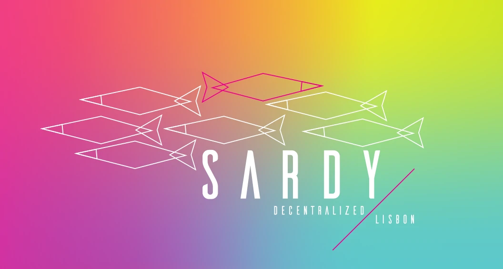

<div align="center">
    
</div>

> dlx é um meetup sobre blockchain ⛓️. Maioritariamente ethereum ⛏️. E as outras coisas todas 🥞 ...

<div align="center">
    <div>
        <a
            href="https://travis-ci.org/dlx-lisbon/dlx-ui"></a>&emsp;
        <a
            href="https://app.netlify.com/sites/dlx/deploys"></a>&emsp;
        <a
            href="https://dependabot.com"></a>&emsp;
    </div>
</div>


Este repositório contém o código para o frontend do nosso website.

## Contribuir
Lê as instruções de [contribuição](CONTRIBUTING.md).

## Desenvolvimento
Neste projeto utilizamos [OrbitDB](https://orbitdb.org/) e [IPFS](https://ipfs.io/) para gerir as nossas publicações. [React](https://reactjs.org/) como framework UI e [Material UI](https://material-ui.com/) para criar o design.

Para começar a fazer alterações e testar, é necessário preencher o `.env` (duplicar `.env.example` e renomear para `.env` deve ser suficiente) e depois executar a app com `yarn start`.

Recomendamos que utilize `yarn` para instalar dependências.

### libp2p-webrtc-star

Este website requer uma instância de [libp2p-webrtc-star](https://github.com/libp2p/js-libp2p-webrtc-star). Para executar localmente é apenas necessário executar o libp2p como indicado [aqui](https://github.com/libp2p/js-libp2p-webrtc-star#rendezvous-server-aka-signalling-server). Para hospedar num servidor externo, com ssl é necessária alguma configuração extra.


Exemplo de configuração nginx:

```yml
upstream websocket {
   server 127.0.0.1:9090;
}

server {
    listen 80;
    listen [::]:80;
    server_name (HOST-NAME);
    return 301 https://(HOST-NAME)$request_uri;
}

server {
    listen 443 ssl;
    listen [::]:443 ssl;
    server_name (HOST-NAME);

    ssl_certificate /etc/letsencrypt/live/(HOST-NAME)/fullchain.pem;
    ssl_certificate_key /etc/letsencrypt/live/(HOST-NAME)/privkey.pem;

    location / {
        proxy_pass http://websocket;
        proxy_http_version 1.1;
        proxy_set_header Upgrade 'Websocket';
        proxy_set_header Connection 'Upgrade';
        proxy_set_header Host (HOST-NAME);
    }
}
```

**NOTA**: Substituir *(HOST-NAME)* pelo hostname utilizado.

## Licença
[GNU General Public License v3](LICENSE)

## Creditos
Peixe palaço no website - Icons made by <a href="https://www.flaticon.com/authors/turkkub" title="turkkub">turkkub</a> from <a href="https://www.flaticon.com/" title="Flaticon">www.flaticon.com</a>
